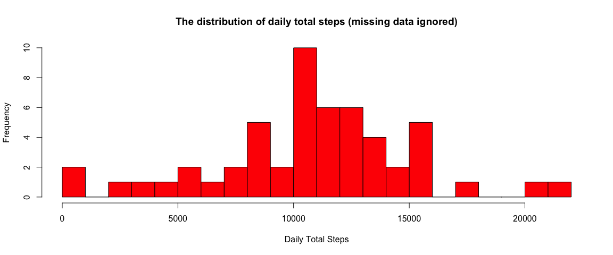
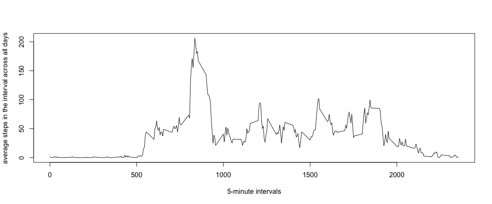
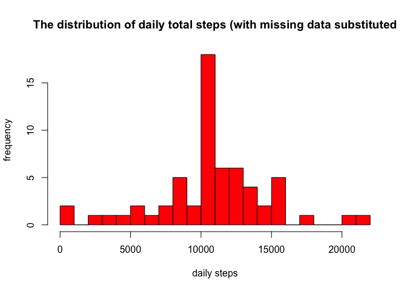
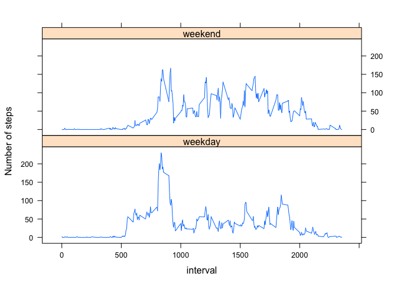

## Loading and preprocessing the data
Set the working directory


```r
setwd("/Users/dad/Documents/Coursera/Data-Science-Specialization/Course5ReproducibleResearch/CourseProject1/RepData_PeerAssessment1")
```

Unzip the 'activity.zip' file to retrieve the csv file


```r
unzip("activity.zip", exdir = "/Users/dad/Documents/Coursera/Data-Science-Specialization/Course5ReproducibleResearch/CourseProject1/RepData_PeerAssessment1/data")
```

Read the data from the csv file into a data frame and display the summary statistics


```r
file <- "/Users/dad/Documents/Coursera/Data-Science-Specialization/Course5ReproducibleResearch/CourseProject1/RepData_PeerAssessment1/data/activity.csv"
activityData <- read.csv(file, stringsAsFactors = FALSE)
str(activityData)
```

```
## 'data.frame':	17568 obs. of  3 variables:
##  $ steps   : int  NA NA NA NA NA NA NA NA NA NA ...
##  $ date    : chr  "2012-10-01" "2012-10-01" "2012-10-01" "2012-10-01" ...
##  $ interval: int  0 5 10 15 20 25 30 35 40 45 ...
```

```r
summary(activityData)
```

```
##      steps            date              interval     
##  Min.   :  0.00   Length:17568       Min.   :   0.0  
##  1st Qu.:  0.00   Class :character   1st Qu.: 588.8  
##  Median :  0.00   Mode  :character   Median :1177.5  
##  Mean   : 37.38                      Mean   :1177.5  
##  3rd Qu.: 12.00                      3rd Qu.:1766.2  
##  Max.   :806.00                      Max.   :2355.0  
##  NA's   :2304
```

Process/transform the data into a format suitable for analysis. The date column is corrected and rows containing missing values are removed. This subset of data is assigned to a new data frame and the original data frame is preserved for later analysis.


```r
activityData$date <- as.Date(activityData$date)
activitySubset <- subset(activityData, !is.na(activityData$steps))
```

## What is mean total number of steps taken per day?

Calculate the daily total number of steps taken


```r
dailySum <- tapply(activitySubset$steps, activitySubset$date, sum, na.rm=TRUE, simplify = T)
dailySum <- dailySum[!is.na(dailySum)]
```

Generate a histogram which displays the distribution of the daily total number of steps taken


```r
hist(x=dailySum, col="red", breaks = 20, xlab = "Daily Total Steps", ylab = "Frequency", main = "The distribution of daily total steps (missing data ignored)")
```

<!-- -->

Calculate and report the mean and median total number of steps taken per day


```r
mean(dailySum)
```

```
## [1] 10766.19
```

```r
median(dailySum)
```

```
## [1] 10765
```

Thus the mean is 10766 steps and the median is 10765 steps.

## What is the average daily activity pattern?

To determine the average daily activity pattern, we create a time series plot of a five minute interval displayed on the x-axis and the average number of steps taken, averaged across all days displayed on the y-axis.


```r
intAvg <- tapply(activitySubset$steps, activitySubset$interval, mean, na.rm=TRUE, simplify = T)
dfintAvg <- data.frame(interval=as.integer(names(intAvg)), avg=intAvg)

with(dfintAvg, plot(interval, avg, type="l", xlab = "5-minute intervals", ylab = "average steps in the interval across all days"))
```

<!-- -->

Determine which 5-minute interval, on average across all days in dataset, contains the maximum number of steps


```r
maxSteps <- max(dfintAvg$avg)
dfintAvg[dfintAvg$avg == maxSteps, ]
```

```
##     interval      avg
## 835      835 206.1698
```

Results indicate that interval 835 contains the maximum number of steps, 206

## Imputing missing values

Calculate and report the total number of missing values in the dataset


```r
sum(is.na(activityData$steps))
```

```
## [1] 2304
```

Thus, the original datset contains 2304 rows with missing data. In order to complete the rows with missing observations, substitute the missing value with the mean of the specific 5-minute interval. Create a new data frame with these substitutions:


```r
dfSubstitution <- activityData
na <- is.na(dfSubstitution$steps)
intAvg <- tapply(activitySubset$steps, activitySubset$interval, mean, na.rm=TRUE, simplify = T)
dfSubstitution$steps[na] <- intAvg[as.character(dfSubstitution$interval[na])]
```

Create a histogram displaying the total number of steps taken each day


```r
newDailySum <- tapply(dfSubstitution$steps, dfSubstitution$date, sum, na.rm=TRUE, simplify = T)
hist(x=newDailySum, col = "red", breaks = 20, xlab = "daily steps", ylab = "frequency", main = "The distribution of daily total steps (with missing data substituted")
```

<!-- -->

Calculate and report the mean and median total number of steps taken per day


```r
mean(newDailySum)
```

```
## [1] 10766.19
```

```r
median(newDailySum)
```

```
## [1] 10766.19
```

The mean is 10766 steps and the median is 10766 steps. From the previous computation, the mean remains the same but the median changes by one step. The new median becomes identical to the mean. One possible explanation for this is the substition of the average value from a five minute interval in place of a missing value. Therefore, more data closely aligns to the mean and thus the median shifts. 

The histogram now displays a higher frequency of observations occuring in the center region (close to the mean).

## Are there differences in activity patterns between weekdays and weekends?

Create a new factor variable 'wk' in the dataset with two levels - weekday and weekend which indicates whether a given date is a weekday or weekend day


```r
#function to decide if day is a weekday or not
isWeekday <- function(d) {
  wd <- weekdays(d)
  ifelse(wd == "Saturday" | wd == "Sunday", "weekend", "weekday")
}
wx <- sapply(dfSubstitution$date, isWeekday)
dfSubstitution$wk <- as.factor(wx)
head(dfSubstitution)
```

```
##       steps       date interval      wk
## 1 1.7169811 2012-10-01        0 weekday
## 2 0.3396226 2012-10-01        5 weekday
## 3 0.1320755 2012-10-01       10 weekday
## 4 0.1509434 2012-10-01       15 weekday
## 5 0.0754717 2012-10-01       20 weekday
## 6 2.0943396 2012-10-01       25 weekday
```

Create a panel plot containing a time series plot (type = "l") of the 5-minute interval (x-axis) and the average number of steps taken, averaged across all weekday days or weekend days(y-axis).


```r
wkDf <- aggregate(steps ~ wk+interval, data=dfSubstitution, FUN=mean)

library(lattice)
xyplot(steps ~ interval | factor(wk), layout = c(1,2), xlab="interval", ylab="Number of steps", type="l", lty=1, data = wkDf)
```

<!-- -->

From the panel plot, it appears that the weekday activities arise earlier than the weekend activities. Weekday activities arise around 5-6am and weekend activities arise around 8am. We can also observe that from 10am to 5pm, the weekend have higher activity levels than weekdays.

